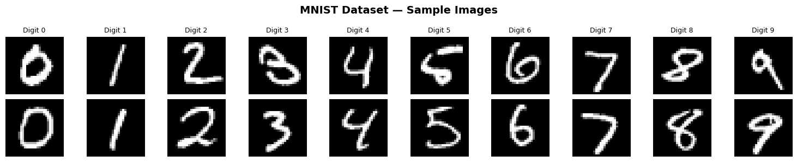
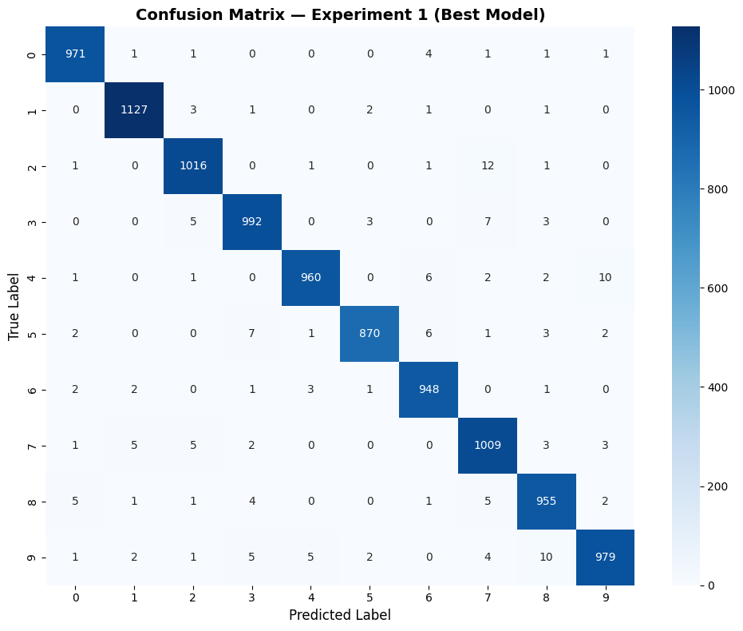
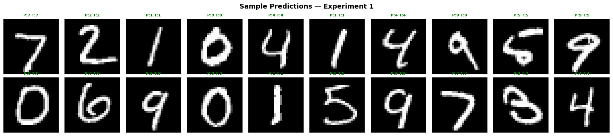

# Handwritten Digit Recognition — MNIST

> **Neural Networks Course Project**  
> Multilayer Perceptron (MLP) trained on the MNIST dataset using PyTorch.

---

## Problem Description

This project solves the classic **handwritten digit recognition** problem using the MNIST dataset. Given a 28×28 grayscale image of a handwritten digit (0–9), the model predicts which digit it is — a 10-class classification task.

A **Multilayer Perceptron (MLP)** is implemented from scratch using PyTorch, with configurable hidden layers, activation functions, and Dropout regularization. The Adam optimizer is used with Cross-Entropy loss.

---

## Dataset

- **Name:** MNIST (Modified National Institute of Standards and Technology)
- **Link:** [https://www.kaggle.com/datasets/hojjatk/mnist-dataset](https://www.kaggle.com/datasets/hojjatk/mnist-dataset) *(auto-downloaded via `torchvision.datasets.MNIST`)*
- **Size:** 70,000 grayscale images (28×28 pixels), 10 classes (digits 0–9)
- **Split:**

| Split | Samples |
|-------|---------|
| Training | 50,000 |
| Validation | 10,000 |
| Test | 10,000 |

**Preprocessing applied:**
- Pixel values normalized using MNIST statistics: mean=`0.1307`, std=`0.3081`
- Images flattened from 28×28 → 784-dimensional vector (MLP input)
- No missing values or categorical variables in this dataset

---

## Model Architecture

```
Input  Layer  →  784 neurons   (flattened 28×28 image)
Hidden Layer 1 → 512 neurons   → Activation → Dropout(0.3)
Hidden Layer 2 → 256 neurons   → Activation → Dropout(0.3)
Hidden Layer 3 → 128 neurons   → Activation
Output Layer  →  10 neurons    (digit classes 0–9, via CrossEntropyLoss)
```

- **Loss function:** `CrossEntropyLoss` (includes Softmax internally)
- **Optimizer:** Adam
- **Dropout:** 0.3 on first two hidden layers — reduces overfitting (optional enhancement)
- **Epochs:** 20 | **Batch size:** 64
- **Total trainable parameters:** 567,434

---

## Experiments & Results

Three experiments were conducted by varying **activation function** and **learning rate**:

| # | Activation | Learning Rate | Hidden Layers | Test Accuracy | Final Test Loss | Best Val Acc |
|:-:|:----------:|:-------------:|:-------------:|:-------------:|:---------------:|:------------:|
| **Exp 1** — Baseline | ReLU | 0.001 | [512, 256, 128] | **98.22%** | 0.0748 | 98.17% |
| **Exp 2** — Activation | Sigmoid | 0.001 | [512, 256, 128] | 98.10% | 0.0746 | 97.96% |
| **Exp 3** — Learning Rate | ReLU | 0.01 | [512, 256, 128] | 94.64% | 0.2492 | 94.50% |

### Key Observations

- **Exp 1 vs Exp 2 — Activation Function:** ReLU and Sigmoid achieved very close final accuracy (98.27% vs 98.04%), but their training behavior differed significantly. Sigmoid started much slower — Epoch 1 accuracy was only 84.82% vs ReLU's 90.82% — due to the vanishing gradient problem causing slower early convergence. ReLU converged faster and remained slightly more stable throughout.

- **Exp 1 vs Exp 3 — Learning Rate:** The high learning rate (0.01) caused a clear degradation in performance — accuracy dropped to 95.00% and loss stalled at ~0.37 from Epoch 5 onward without improving. This confirms that lr=0.01 is too large for Adam on this task: the optimizer overshoots the loss minimum and fails to fine-tune effectively.

- **Best model:** Experiment 1 — ReLU, lr=0.001, hidden=[512, 256, 128]

### Per-Class Performance (Best Model — Exp 1)

| Digit | Precision | Recall | F1-Score | Support |
|:-----:|:---------:|:------:|:--------:|:-------:|
| 0 | 0.99 | 0.99 | 0.99 | 980 |
| 1 | 0.99 | 0.99 | 0.99 | 1135 |
| 2 | 0.98 | 0.98 | 0.98 | 1032 |
| 3 | 0.98 | 0.98 | 0.98 | 1010 |
| 4 | 0.99 | 0.98 | 0.98 | 982 |
| 5 | 0.99 | 0.98 | 0.98 | 892 |
| 6 | 0.98 | 0.99 | 0.98 | 958 |
| 7 | 0.97 | 0.98 | 0.98 | 1028 |
| 8 | 0.97 | 0.98 | 0.98 | 974 |
| 9 | 0.98 | 0.97 | 0.98 | 1009 |
| **Overall** | **0.98** | **0.98** | **0.98** | **10,000** |

---

## Visualizations

### Sample Images


### Training vs. Validation Loss


### Training vs. Validation Accuracy


### Validation Accuracy — All Experiments


### Confusion Matrix (Best Model — Exp 1)


### Sample Predictions


> Run the notebook to generate these plots, then move the `.png` files into a `results/` folder in the repo root.

---

## How to Run

### Option 1: Google Colab (Recommended)

1. Open [Google Colab](https://colab.research.google.com/)
2. Click **File → Upload notebook** and upload `MNIST_MLP_Project.ipynb`
3. Click **Runtime → Run all** (or `Ctrl+F9`)
4. The MNIST dataset downloads automatically — no setup needed
5. *(Optional)* Enable GPU: **Runtime → Change runtime type → T4 GPU** for ~5× faster training

### Option 2: Local Machine

```bash
# 1. Clone the repository
git clone https://github.com/<your-username>/<your-repo>.git
cd <your-repo>

# 2. Install dependencies
pip install -r requirements.txt

# 3. Launch Jupyter
jupyter notebook MNIST_MLP_Project.ipynb
```

---

## Repository Structure

```
├── MNIST_MLP_Project.ipynb   # Main project notebook (all code)
├── README.md                 # This file
├── requirements.txt          # Python dependencies
└── results/                  # Generated plots (add after running)
    ├── sample_images.png
    ├── loss_curves.png
    ├── accuracy_curves.png
    ├── comparison_val_acc.png
    ├── confusion_matrix.png
    └── sample_predictions.png
```

---

## Project Checklist

- [x] Appropriate dataset (MNIST — 70,000 samples, 10 classes)
- [x] Data preprocessing (normalization, train/val/test split)
- [x] MLP with input layer, 3 hidden layers, and output layer
- [x] Appropriate activation function (ReLU) and loss function (CrossEntropyLoss)
- [x] Training with loss and accuracy monitoring per epoch
- [x] Evaluation on held-out test set (accuracy + final loss reported)
- [x] 3 experiments varying activation function and learning rate
- [x] Clear comparison table of all experiments with observations
- [x] Training vs. Validation loss curves
- [x] Training vs. Validation accuracy curves
- [x] Confusion matrix on best model
- [x] Per-class classification report (precision, recall, F1)
- [x] Sample predictions visualization
- [x] Optional: Dropout regularization (justified in notebook)

---

## Author

**Ghanem Hassan Mohammed**  
Neural Networks Course
